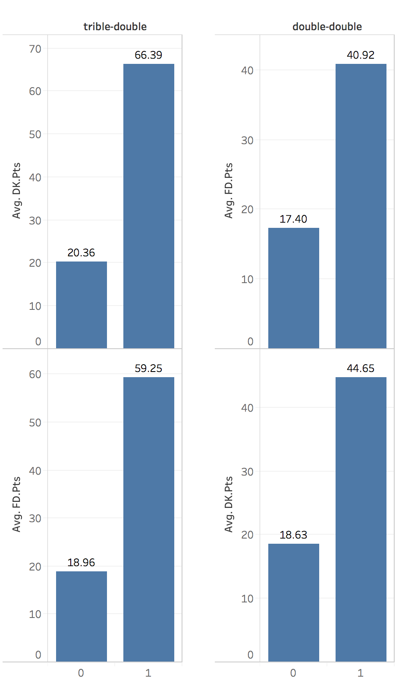
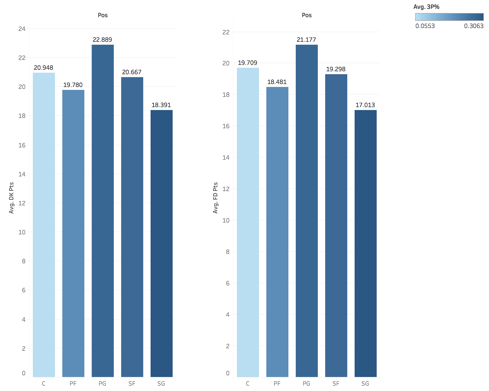

###Summary:
We have developed a Statistical Linear Regression Predictor Model using OLS(Ordinary Least Squares) method for estimating and predicting NBA fantasy scores based on various scoring and non-scoring parameters.Used **R(RStudio)** for creating the model and **Tableau** for visualizing the data. 

Data cleaning and transformations(explained further below) were performed prior to model generation and cross-validation technique was used to increase the prediction accuracy of the model. We followed both top-down and bottom-up techniques to go through all the parameters(predictors) and included only the ones which are significant enough to impact the final fantasy score. 

###Data Cleaning Activities:
The game log data included 40 scoring and non-scoring parameters for all the players(across 18612 rows). We found 120 records(rows) having missing values(#NA) which were removed from the model generation process as the number is not significant enough to impact the final model. So the final observation count used in the model generation process is **18492**. 

#### Data Transformations:
Prior to model generation we had to transform some parameters to suit the statistical method that we used. We also created a couple of other parameters based on the scoring rules from both the contests. 
**1. One-hot encoding:** We split the "Position" parameter into 5 different parameters(one for each position) which will not only help in understanding the significance of each position has on the final points scored through the player but also makes the model generation process lot easier. 
**2. Accumulation Columns:** For DraftKings Contest, there are bonus points awarded for **double-doubles** and **triple-doubles** accumulated.So we created a couple of extra columns(binary) indicating whether a double-double or triple-double is scored. These columns were later integrated into our models for both DraftKings and FanDuel. 
**3. Home/Away Column:** We created a new column which indicates whether the match played was either a home match or an away one to see whether it impacts the scoring of a player. 
We performed few other data transformations to make it easier for model generation.

###Model Generation:
For generating the Linear Regression Prediction Model we used the OLS(Ordinary Least Squares)method. The objective of this method is to develop a model with the least sum of squares error(prediction error) possible between the observed score and those predicted using the model. The smaller the error, the better the model fits the data.  
To prevent the phenomenon of "overfitting"(model working well on the data it was trained on but not with future data) we followed a technique called **Cross-Validation**. In this technique we split the entire data(all 18,492 rows) into two partitions one for training/developing the model and the other to test and validate the model for accuracy. In this case we split the entire data into 70% as Training Data(approximately 13000 data points) and 30% as Testing Data(approximately 5500 data points) respectively which is a general rule of thumb  
We followed both top-down(adding one after another) and bottom-up(adding all and removing one after another)approaches to design the model by removing insignificant parameters at each step. We also took care to prevent the multicollinearity(problem of adding two highly correlated predictors in the model) problem between the predictors by finding **Variance Inflation Factor** values for all the predictors at each step.**Variance Inflation Factor** indicates how much the variance of the estimated predictors are inflated as compared to when they are not significantly related. Lower VIF values are desired to indicate the absence of multicollinearity.
The final models that we have developed is given below.
$$DK.Pts = -2.78 + (0.307*PosSF) + (0.404*PosPF) + (2.905*PosPG) + (0.561*PosSG) + \\(0.175*Type) + (0.107*MP) + (1.922*X2P) + (3.276*X3P) + (1.065*FT) + (1.013*TRB) + \\(2.079*STL) + (1.756*BLK) + (-0.102*PF) + (0.025*DK.Sal) + (0.003*DK.Val) + \\(4.536*dd) + (15.143*td)$$

$$FD.Pts = -3.14 + (0.452*PosSF) + (0.491*PosPF) + (3.069*PosPG) + (0.704*PosSG) + \\(0.187*Type) + (0.070*MP) + (1.904*X2P) + (2.730*X3P) + (1.084*FT) + (1.100*TRB) + \\(1.999*STL) + (1.711*BLK) + (-0.165*PF) + (0.022*DK.Sal) + (0.005*DK.Val) + \\(4.536*dd) + (15.143*td)$$
PosSF, PosPF, POSPG... are the various predictors in the model and the coefficients are the weights assigned to them in the final model. Higher the number, greater the significance. At first look both the models look very similar which indicates similar scoring models for both the contests.

<h6>Both the model VIF values are listed above. The desired value is < 4 which is the case in both our models.<h6>

###Key Model Statistics:
Both the models(one for Fan Duel and another for DraftKings) have high **coefficient of determination** values of **96.5%** and **95.4%** respectively with the training data which is very high. The **Standard Error**(with 95% confidence) of the models are **2.671** and **2.825** which are also very low. 
All these metrics indicate the models to be very accurate. To test this accuracy, we tested both these models on the test data by predicting the points scored for around 4500 data points. We found literally no changes in the **coefficient of determination** values which were at **95.4%**(for DraftKings model) and **95.5%** respectively. The **Standard Error For estimates**(with 95% confidence) were  **2.61** and **2.74** which indicated both the models predicted the test data very accurately. 

<h6>The above confidence interval plots indicate the prediction intervals of both the models nicely encapsulate the observed values and also the observed values are very close to the predicted values</h6>

###Key Outtakes: 
**1. Multi-dimensional players-Highly Valued:** Multi-dimensional players who rack up double-doubles and triple-doubles have the the highest weightage and hence score the most points. This observation was backed up by the player leaderboard which is dominated by players(like Russel Westbrook, James Harden and Anthony) who have most triple-doubles or double-double.

<h6>The above image clearly shows the difference in average fantasy scores for players with and without double-double's and triple-double's.</h6>

**2. 3PT FG%-Highly Significant:** We found high significance between high 3PT FG% and fantasy scoring. In both the models we see very high weightage for 3PT FG% predictor and the average fantasy score for good 3PT scorers are relatively high.

**3. Point-Guard domination:** We already know that point-guards like Russel Westbrook, James Harden and Isiah Thomas are dominating the league and are the front-runners for the MVP award. This notion is supported by our model as well, with the third most significant predictor is being a point guard. Also the average fantasy score is highest for point-guards.

<h6>The above image shows that the average fantasy scores for point guards is the highest and also they lead in the 3PT FG% as well which increases their high scoring chances.</h6>

###Conclusion:
Based on all the models we designed and the tests we conducted we can say that our models are highly stable, and accurate enough to predict future data with the least possible variance.